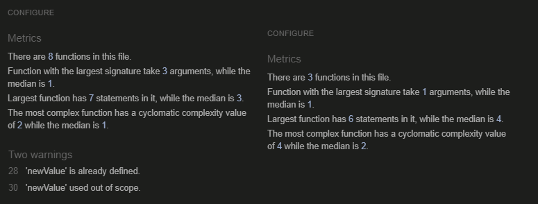
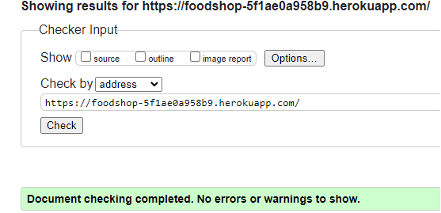
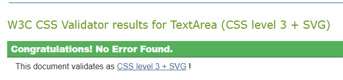
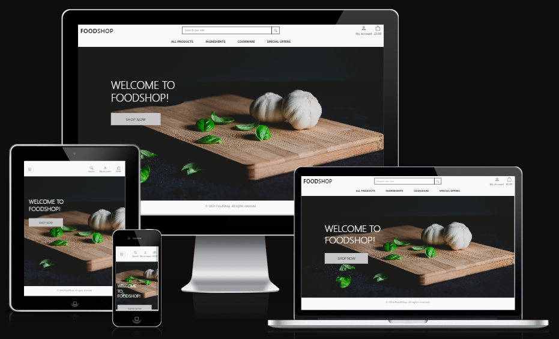

# FoodShop

## A Sample E-Commerce Store
This is a website that demonstrates my ability to design and create an e-commerce store using Django, CSS, HTML and Javascript. It's designed to meet several user stories, including being able to log in, browse items, add them to a basket, pay for those items using Stripe, receive email confirmation of orders, and have the order information retained in your profile; and as the owner of the shop, to be able to add, edit and delete items, see orders that have been made, and otherwise manage the content of the site. It is based around the Code Institute walkthrough project 'Boutique Ado' and is a final milestone project for Code Institute's Full Stack Web Development 1-year intensive course.

## User Stories
As a user, I want to be able to:
+ See products
+ Sort products based on criteria such as rating, price, category
+ Search for products
+ Inspect individual products
+ Add products to my basket and have that basket maintain its contents as I continue to browse
+ Purchase the items in my basket
+ Receive an email confirming my purchase
+ Login or sign up at any point in this process
+ See previous orders in my profile
+ Log out

As an admin, in addition to the previous points, I want to be able to:
+ Add products to the store
+ Edit existing products
+ Delete products
+ View customer orders

## Features and Wireframe
This site comprises several Python apps working together, each one fulfilling a different set of user stories. For example, the Checkout experience is handled entirely by one Python app, with multiple screens and experiences.

The images presented here are not final, and are indicative of what a user might see at the point in prototyping that this section of the Readme was written. Colours and designs are not final and are subject to change after prototyping and user testing.

### Main Page


Information to be added, and further sections

### Entity Relationship Document


Information to be added

## Upcoming features
+ Ratings system. I've included a rating for each product, but this is not connected to anything and is merely for aesthetic purposes at the moment. It would be good to include some sort of system for verified purchasers of products to be able to rate their purchases and for that rating to be applied sitewide. Ultimately, when I got to the end of the project, going back to add this in would have been very difficult for me, as the site was not built with this functionality in mind. Thus, for the scope of this project, it was not a feature I included.
+ Social logins. Similarly,

## Technology
+ This website is made with
+ Databasing is provided by MongoDB
+ Deployment is from Heroku
+ Images are handled by AWS
+ Static files are handled by
+ Wireframe and prototyping images were made in Figma
+ Additional software used to create this website include Photoshop for image editing and Firefox for previewing, inspecting and bug testing, as well as Chrome for the Lighthouse report

## Testing
### Test Case: Main Page (not logged in)
+ Testcases to be added here


### Bugs discovered
+ Bugs to be added here

## Code validation

### Lighthouse Report:


### <a href="https://pep8ci.herokuapp.com/#" target="_blank">Code Institute Linter</a>


### <a href="https://jshint.com/" target="_blank">JSHint</a>


### <a href="https://validator.w3.org/" target="_blank">W3C</a>


### <a href="https://jigsaw.w3.org/" target="_blank">Jigsaw</a>


## Supported Screens and Browsers
+ This website works in any browser and at any screen size, from desktop down to smart phones.
+ It has been developed and tested for Chrome, and smaller screen sizes have been simulated with Chrome's Inspect tool. Sample screens of all currently-available smart phones have been tested through Chrome's developer tool. It has also been tested natively on a Pixel 7a device and a Pixel 6 Pro.



## Deployment
This website has been deployed on Heroku, the deployment for which is available at DEPLOYMENT ADDRESS. It can also be deployed locally on your machine.

To view the deployment on Heroku:

+ Navigate to DEPLOYMENT ADDRESS

To clone the repository from Github in your editor of choice:

+ First, open your terminal.
+ Change the current working directory to the location where you want the cloned directory.
+ Input: ```bash
+ Input: cd path/to/your/directory (ensure you change the directory to whatever you want to clone the repository)
+ Clone the repository by running: git clone https://github.com/stevecook23/foodshop.git
+ Change directories into the cloned repository: cd foodshop

Now you have a copy of the source code and can start to work on it. Bear in mind that the contents of the .env file, or the environment variables throughout the project, will not be publicly available - you will need to provide this file and these details yourself.

To deploy the site locally on your machine, after you have cloned the repository from Github, please do the following:

+ Open your terminal
+ Input: python3 app.py
+ You will see several lines of text, including 'Running on' and an address
+ Ctrl-click the address, or copy it into your browser of choice

You should now be able to view the app locally.

## Credits
### Text Content
Text for the site was generated by me.

### Media
All media on this site was sourced from [pxhere.com ](https://pxhere.com/) and is used free of royalty or copyright, and with permission, under the Creative Commons Zero (CC0) license. 