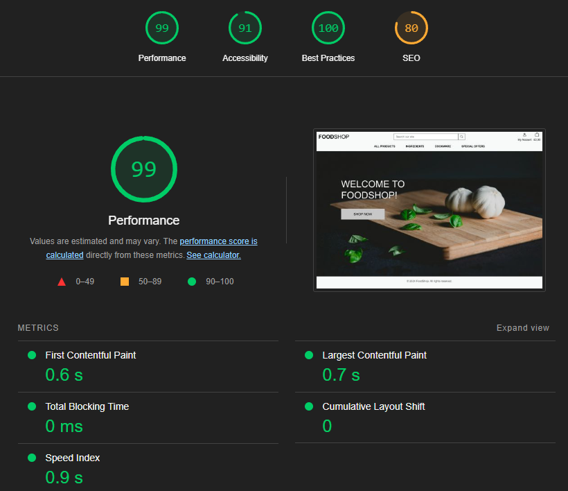

# FoodShop

## A Sample E-Commerce Store
This is a website that demonstrates my ability to design and create an e-commerce store using Django, CSS, HTML and Javascript. It's designed to meet several user stories, including being able to log in, browse items, add them to a basket, pay for those items using Stripe, receive email confirmation of orders, and have the order information retained in your profile; and as the owner of the shop, to be able to add, edit and delete items, see orders that have been made, and otherwise manage the content of the site. It is based around the Code Institute walkthrough project 'Boutique Ado' and is a final milestone project for Code Institute's Full Stack Web Development 1-year intensive course.

## User Stories
As a user, I want to be able to:
+ See products
+ Sort products based on criteria such as rating, price, category
+ Search for products
+ Inspect individual products
+ Add products to my basket and have that basket maintain its contents as I continue to browse
+ Purchase the items in my basket
+ Receive an email confirming my purchase
+ Login or sign up at any point in this process
+ See previous orders in my profile
+ Log out
+ Review products, and have CRUD functionality over my reviews
+ Log favourites, and see my favourites in one place

As an admin, in addition to the previous points, I want to be able to:
+ Add products to the store
+ Edit existing products
+ Delete products
+ View customer orders
+ Have CRUD functionality over customer reviews in case of malicious use

## Features and Wireframe
This site comprises several Python apps working together, each one fulfilling a different set of user stories. For example, the Checkout experience is handled entirely by one Python app, with multiple screens and experiences.

The images presented here are not final, and are indicative of what a user might see at the point in prototyping that this section of the Readme was written. Colours and designs are not final and are subject to change after prototyping and user testing.

### Home Page


As with all the pages, this page will have a header containing the menu (collapsed in mobile view) and a footer. The header will also contain the search bar and bag-related links.

The home page is designed to be a splash screen with a single image.

### All Products Page


This page, in addition to the ever-present header and footer, will contain square Bootstrap cards with product images and details. On smaller sizes of screen, this will be 3, 2 or 1 cards per row.

### Product Details Page


Clicking in to any of the products on the previous page will bring the user to a products detail page. As well as more detailed information about the product, 'related products' will be displayed at the bottom, in smaller mini-cards, and again limited in number by screen size

### Checkout Page


A checkout page, with a place for the customer to fill in their information on the left, and a summary of their order on the right. Checkout would be by Stripe.

### Profile Page


This page would have a place for registered and logged-in users to edit their address details, and view their previous orders.

### Entity Relationship Document


## Upcoming features
+ Ratings system. I've included a rating for each product, but this is not connected to anything and is merely for aesthetic purposes at the moment. It would be good to include some sort of system for verified purchasers of products to be able to rate their purchases and for that rating to be applied sitewide. Ultimately, when I got to the end of the project, going back to add this in would have been very difficult for me, as the site was not built with this functionality in mind. Thus, for the scope of this project, it was not a feature I included.
+ Social logins. Similarly, I wanted to include social logins.
+ Saved addresses; not currently implemented, the ability to add addresses saved on profile would be useful.

## Technology
+ This website is made in its entirety using Visual Studio Code for Desktop
+ Databasing is provided by MongoDB
+ Deployment is from Heroku
+ Images are handled by AWS
+ Static files are handled by AWS
+ Wireframe and prototyping images were made in Figma
+ Additional software used to create this website includes Chrome for previewing, inspecting and bug testing

## Testing
This section details manual testing that I undertook as part of my project. Because of the length of this section in text form, I have opted not to include screenshots of each test.

### Test Case: Navigation and Responsiveness
+ Click on each navigation link (Home, Products, About, Contact, etc.); each should lead to the correct page
+ Resize browser window from desktop to tablet to mobile sizes; layout should adjust appropriately
+ On mobile view, verify that the hamburger menu appears and functions correctly
+ Scroll through long pages; header should remain fixed at the top for easy navigation

### Test Case: Product Listings
+ Navigate to the Products page; all products should be visible and properly formatted
+ Use the category filter; only products from the selected category should display
+ Use the sort function (e.g., price low to high); products should reorder correctly
+ Click on a product; it should lead to the correct product detail page

### Test Case: Product Detail Page
+ Verify that all product information (name, price, description, image) is displayed correctly
+ Adjust the quantity using the + and - buttons; quantity should update accordingly
+ Click 'Add to Bag'; product should be added to the shopping bag
+ If logged in as admin, verify that 'Edit' and 'Delete' options are visible and functional

### Test Case: Shopping Bag
+ Add multiple items to the bag; all items should be visible in the bag
+ Adjust quantities in the bag; subtotal and grand total should update correctly
+ Remove an item from the bag; it should disappear and totals should update
+ Click 'Secure Checkout'; it should lead to the checkout page

### Test Case: Checkout Process
+ Fill out the checkout form; all required fields should be validated
+ Use an invalid credit card number; an error message should appear
+ Use a valid credit card number; the order should process successfully
+ After successful checkout, verify that a confirmation email is received

### Test Case: User Account
+ Register a new account; verify that the registration process works
+ Log in with the new account; should be redirected to the home page
+ Navigate to the profile page; personal information and order history should be visible
+ Update profile information; changes should be saved successfully

### Test Case: Admin Functionality
+ Log in as an admin user
+ Navigate to the product management page; should be able to add a new product
+ Edit an existing product; changes should be saved and reflected on the site
+ Delete a product; it should be removed from the product listings

### Test Case: Search Functionality
+ Use the search bar with a valid product name; relevant products should appear in results
+ Search with a category name; products from that category should be displayed
+ Perform an empty search; it should return all products or an appropriate message

### Bugs discovered
+ During development, the number one bug I encountered was to do with image dimensions. This is something that came up frequently, as there were lots of places where I wanted images to be square, but there were also lots of ways for this to fail. In the end, an image-wrapper system made the most sense.
+ I fixed a bug with the 'load more' button. The logic behind it correctly provided more items... but the items weren't always in the same category, and the 'load more' button didn't remove itself when all the products were loaded. I removed this bug in commit c4503d2.
+ I accidentally introduced a bug myself by mistakenly removing the Javascript that made the Favourites button work while modifying other things about the page. Luckily I was able to reinstate it. In doing so, I discovered a more subtle bug pertaining to the Favourites status not being maintained when navigating to or from a product. This is now resolved.
+ Other than the image dimensions, the most pervasive bug was with the white overlay. By default, using z-index as -1 did not place it in the right place. I'm not sure why. In the end, it was easier to modify the z-indexes of various other things to ensure they were presented correctly.
+ Adding an amount more than 99 to the quantity on some pages and pressing enter reverts it to 98. Ultimately the code still allows you to add 99 of something, and this is a relatively niche end-user issue - I don't imagine that anyone using this site will actually want to add 99 of anything to their basket. As the code is working, I am reluctant to adjust it to work out why it reverts to 98 instead of 99 when enter is pressed.

## Code validation

### Lighthouse Report:


### Linter
In this case, linting was done using the extension 'Flake8' for Visual Studio Code. Code has been refactored to include standard expectations, including double line breaks, removing white space, etc.

### <a href="https://jshint.com/" target="_blank">JSHint</a>


Although other JavaScript appears in my site, the most-used JS is for the Quantity Increment/Decrement, which I've checked using JSHint.

### <a href="https://validator.w3.org/" target="_blank">W3C</a>


### <a href="https://jigsaw.w3.org/" target="_blank">Jigsaw</a>


## Supported Screens and Browsers
+ This website works in any browser and at any screen size, from desktop down to smart phones.
+ It has been developed and tested for Chrome, and smaller screen sizes have been simulated with Chrome's Inspect tool. Sample screens of all currently-available smart phones have been tested through Chrome's developer tool. It has also been tested natively on a Pixel 7a device and a Pixel 6 Pro.


## Deployment
This website has been deployed on Heroku, the deployment for which is available at DEPLOYMENT ADDRESS. It can also be deployed locally on your machine.

To view the deployment on Heroku:

+ Navigate to https://foodshop-5f1ae0a958b9.herokuapp.com/

To clone the repository from Github in your editor of choice:

+ First, open your terminal.
+ Change the current working directory to the location where you want the cloned directory.
+ Input: ```bash
+ Input: cd path/to/your/directory (ensure you change the directory to whatever you want to clone the repository)
+ Clone the repository by running: git clone https://github.com/stevecook23/foodshop.git
+ Change directories into the cloned repository: cd foodshop

Now you have a copy of the source code and can start to work on it. Bear in mind that the contents of the .env file, or the environment variables throughout the project, will not be publicly available - you will need to provide this file and these details yourself.

To deploy the site locally on your machine, after you have cloned the repository from Github, please do the following:

+ Open your terminal
+ Input: python3 app.py
+ You will see several lines of text, including 'Running on' and an address
+ Ctrl-click the address, or copy it into your browser of choice

You should now be able to view the app locally.

## Credits
### Text Content
Text for the site is original and is by the site's creator.

### Media
All media on this site was sourced from [pxhere.com ](https://pxhere.com/) and is used free of royalty or copyright, and with permission, under the Creative Commons Zero (CC0) license. Individual image attribution is not required under that licence.

### Code Attribution
Some code can be attributed to sources other than myself, such as the Stripe code; where code has been used from other sources, it has been explicitly called out within the code - for example, the custom middleware I am using to prevent non-admin access to /admin. Some similarities exist to the Code Institute project 'Boutique Ado', upon which this project was based. However, I have used exclusively up-to-date packages where possible, and updated throughout from Bootstrap 4 to Bootstrap 5, where the 'Boutique Ado' project used Bootstrap 4 and many outdated packages. Additionally, this site's functionality adds, among other things:
+ a Reviews model and interface
+ a Favourites model and interface
+ pagination to the 'all products' view 
+ a thumbnailing system